# KPI Forecasting for Media Campaigns

[](https://www.python.org/)
[](https://jupyter.org/)
[](LICENSE)

## 🎯 Project Overview

This **academic simulation project** demonstrates the application of time series forecasting techniques to media campaign optimization challenges. Using synthetically generated campaign data, this analysis explores how predictive modeling could theoretically be applied to forecast key marketing KPIs including **Cost Per Acquisition (CPA)**, **Return on Ad Spend (ROAS)**, daily spend, and conversion metrics.

The project serves as a learning exercise to understand how data science methodologies might be applied in marketing analytics contexts, while exploring the practical challenges and limitations of forecasting in dynamic advertising environments.

## 📊 Learning Objectives

- **🔍 Methodology Application**: Apply time series analysis techniques to marketing data challenges
- **🔮 Model Comparison**: Compare ARIMA vs ETS forecasting approaches for different KPI types
- **💰 Scenario Analysis**: Demonstrate how predictive models could inform budget allocation decisions
- **📈 Business Context**: Translate statistical findings into business-relevant insights and recommendations
- **⚡ Critical Thinking**: Evaluate model limitations and real-world implementation challenges

## 🔄 Workflow Summary

```mermaid
graph TD
    A["📊 Synthetic Data Generation<br/>180 days of campaign data"] --> B["🔍 Exploratory Data Analysis<br/>Statistical analysis & visualization"]
    B --> C["📈 Time Series Modeling<br/>ARIMA & ETS models"]
    C --> D["⚖️ Model Performance Evaluation<br/>MAPE, RMSE, MAE metrics"]
    D --> E["💰 Budget Scenario Analysis<br/>4 optimization strategies"]
    E --> F["🎯 Strategic Insights<br/>Actionable recommendations"]
```



### 1. Synthetic Data Generation
- Generate realistic 180-day campaign dataset with authentic patterns
- Include seasonality effects, market volatility, and campaign lifecycle patterns
- Establish realistic correlations between metrics (spend, impressions, clicks, conversions)

### 2. Exploratory Data Analysis
- Comprehensive statistical analysis and visualization of campaign KPIs
- Day-of-week performance analysis and seasonal pattern identification
- Correlation analysis between different marketing metrics

### 3. Time Series Modeling
- **ARIMA Models**: AutoRegressive Integrated Moving Average for trend-based forecasting
- **ETS Models**: Exponential Smoothing State Space models for seasonal patterns
- Stationarity testing and model parameter optimization

### 4. Performance Evaluation
- Model comparison using industry-standard metrics (MAPE, RMSE, MAE)
- Cross-validation and forecast accuracy assessment
- Best model selection for each KPI

### 5. Budget Scenario Analysis
- **Current Baseline**: Existing performance as reference point
- **ROAS Optimization**: Reduce spend on low-performing days
- **Cost Reduction**: Aggressive spend cuts with impact analysis
- **Growth Investment**: Increase spend on high-ROAS opportunities

### 6. Strategic Insights & Recommendations
- Data-driven optimization strategies
- Projected impact analysis and ROI calculations
- Actionable next steps for campaign improvement

## 💡 Analytical Insights & Theoretical Impact

```mermaid
graph TD
    A["📈 Current Performance"] --> B["🔮 Predictive Forecasting"]
    B --> C{"💡 Optimization Strategy"}
    
    C --> D1["📊 Theoretical Improvements"]
    C --> D2["💰 Cost Analysis"]
    C --> D3["🎯 Strategic Insights"]
    
    D1 --> E["🚀 Learning Outcomes"]
    D2 --> E
    D3 --> E
```



### 🚀 Methodological Findings
- **Model Performance**: ARIMA vs ETS comparison reveals different strengths for various KPI types
- **Forecasting Accuracy**: Analysis demonstrates reasonable predictive capability within synthetic data constraints
- **Scenario Planning**: Framework shows potential for data-driven budget allocation approaches

### 💰 Theoretical Optimization Opportunities
- Models suggest potential cost savings through performance-based spending patterns
- Budget reallocation scenarios demonstrate possible efficiency improvements
- Analysis identifies periods where spend adjustments could theoretically improve ROAS

### 📈 Academic Learning Outcomes
- **Applied Analytics**: Successfully implemented time series forecasting in marketing context
- **Business Translation**: Converted statistical findings into business-relevant recommendations
- **Critical Evaluation**: Recognized model limitations and real-world implementation challenges

## 🏗️ Model Architecture & Data Flow

```mermaid
graph LR
    subgraph "📊 Input Data"
        A1["Daily Spend"]
        A2["Impressions"]
        A3["Clicks"]
        A4["Conversions"]
        A5["CPA"]
        A6["ROAS"]
    end
    
    subgraph "🔮 Forecasting Models"
        B1["ARIMA<br/>Trend-based"]
        B2["ETS<br/>Seasonal patterns"]
    end
    
    subgraph "💰 Optimization Scenarios"
        C1["Current Baseline"]
        C2["ROAS Optimized"]
        C3["Cost Reduction"]
        C4["Growth Investment"]
    end
    
    A1 --> B1
    A2 --> B1
    A3 --> B2
    A4 --> B2
    A5 --> B1
    A6 --> B2
    
    B1 --> C1
    B1 --> C2
    B2 --> C3
    B2 --> C4
```



## 🛠️ Technologies Used

- **Python 3.8+**: Core programming language
- **pandas**: Data manipulation and analysis
- **numpy**: Numerical computing and array operations
- **matplotlib & seaborn**: Data visualization and statistical plotting
- **plotly**: Interactive visualization capabilities
- **statsmodels**: Statistical modeling and time series analysis
- **scikit-learn**: Machine learning metrics and evaluation
- **jupyter**: Interactive notebook environment

## 🚀 How to Run

### Prerequisites

1. **Python Environment**: Python 3.8 or higher
2. **Package Installation**: Install required dependencies

```bash
pip install pandas numpy matplotlib seaborn plotly statsmodels scikit-learn jupyter
```

### Execution Steps

1. **Clone the Repository**
```bash
git clone https://github.com/asadadnan11/kpi-forecasting-for-media-campaigns.git
cd kpi-forecasting-for-media-campaigns
```

2. **Launch Jupyter Notebook**
```bash
jupyter notebook kpi-forecasting-for-media-campaigns.IPYNB
```

3. **Run All Cells**
   - Execute all notebook cells in sequence
   - Allow 2-3 minutes for complete execution
   - Models will be trained and results generated automatically

### Expected Outputs

- **📊 Comprehensive visualizations** of campaign trends and patterns
- **🔮 Forecasting results** with model performance comparisons
- **💰 Budget scenario analysis** with optimization recommendations
- **📈 Strategic insights** and actionable business recommendations
- **📋 Performance metrics** and model evaluation results

## 📁 Project Structure

```
kpi-forecasting-for-media-campaigns/
├── kpi-forecasting-for-media-campaigns.IPYNB  # Main analysis notebook
├── README.md                                   # Project documentation
└── LICENSE                                     # MIT License
```

## 🎯 Academic Applications

- **Business Analytics Students**: Learn time series forecasting methodology in marketing context
- **Marketing Research**: Understand predictive modeling approaches for campaign optimization
- **Data Science Education**: Practice implementing ARIMA/ETS models with business interpretation
- **Case Study Analysis**: Explore theoretical application of analytics to marketing challenges

## 🔮 Future Enhancements

- **Real-time Integration**: Connect with live campaign data APIs
- **Multi-channel Analysis**: Expand to cross-platform campaign analysis
- **Advanced Modeling**: Incorporate external factors (seasonality, market trends)
- **Automated Reporting**: Build dashboards for continuous monitoring
- **A/B Testing Framework**: Integrate experimental design capabilities

## 📝 Academic Context & Limitations

> **🎓 ACADEMIC SIMULATION**: This project is designed as a **graduate-level business school simulation** using entirely synthetic data. All campaign data, performance metrics, and optimization results are artificially generated for educational purposes.
> 
> **⚠️ IMPORTANT LIMITATIONS**: 
> - Results do not reflect real marketing campaign performance
> - Efficiency gains and cost savings are theoretical calculations based on synthetic data
> - Real-world implementation would face additional challenges (market dynamics, competitive responses, data quality issues)
> - Models have not been validated against actual campaign data
> 
> This analysis demonstrates **methodology and analytical thinking** rather than proven business outcomes.

## 🤝 Contributing

Contributions are welcome! Please feel free to submit a Pull Request or open an Issue for suggestions and improvements.

## 📄 License

This project is licensed under the MIT License - see the [LICENSE](LICENSE) file for details.

---

**📚 This simulation demonstrates the application of time series forecasting to marketing analytics challenges, serving as a learning exercise in business data science methodology.**