# KPI Forecasting for Media Campaigns

[](https://www.python.org/)
[](https://jupyter.org/)
[](LICENSE)

## 🎯 Project Overview

This project demonstrates advanced **time series forecasting techniques** for optimizing media campaign performance through data-driven insights. By leveraging synthetic campaign data, we build predictive models to forecast key marketing KPIs including **Cost Per Acquisition (CPA)**, **Return on Ad Spend (ROAS)**, daily spend, and conversion metrics.

The solution enables marketing teams to make proactive budget allocation decisions, identify optimization opportunities, and maximize campaign efficiency through predictive analytics.

## 📊 Key Objectives

- **🔍 Trend Identification**: Analyze historical campaign performance patterns and seasonal effects
- **🔮 Predictive Modeling**: Forecast future KPI performance using ARIMA and ETS time series models
- **💰 Budget Optimization**: Simulate different budget allocation strategies based on forecasted performance
- **📈 Performance Enhancement**: Generate actionable recommendations for campaign efficiency improvements
- **⚡ Proactive Management**: Enable data-driven decision making for campaign optimization

## 🔄 Workflow Summary

```mermaid
graph TD
    A["📊 Synthetic Data Generation<br/>180 days of campaign data"] --> B["🔍 Exploratory Data Analysis<br/>Statistical analysis & visualization"]
    B --> C["📈 Time Series Modeling<br/>ARIMA & ETS models"]
    C --> D["⚖️ Model Performance Evaluation<br/>MAPE, RMSE, MAE metrics"]
    D --> E["💰 Budget Scenario Analysis<br/>4 optimization strategies"]
    E --> F["🎯 Strategic Insights<br/>Actionable recommendations"]
    
    style A fill:#e1f5fe
    style B fill:#f3e5f5
    style C fill:#e8f5e8
    style D fill:#fff3e0
    style E fill:#fce4ec
    style F fill:#f1f8e9
```



### 1. Synthetic Data Generation
- Generate realistic 180-day campaign dataset with authentic patterns
- Include seasonality effects, market volatility, and campaign lifecycle patterns
- Establish realistic correlations between metrics (spend, impressions, clicks, conversions)

### 2. Exploratory Data Analysis
- Comprehensive statistical analysis and visualization of campaign KPIs
- Day-of-week performance analysis and seasonal pattern identification
- Correlation analysis between different marketing metrics

### 3. Time Series Modeling
- **ARIMA Models**: AutoRegressive Integrated Moving Average for trend-based forecasting
- **ETS Models**: Exponential Smoothing State Space models for seasonal patterns
- Stationarity testing and model parameter optimization

### 4. Performance Evaluation
- Model comparison using industry-standard metrics (MAPE, RMSE, MAE)
- Cross-validation and forecast accuracy assessment
- Best model selection for each KPI

### 5. Budget Scenario Analysis
- **Current Baseline**: Existing performance as reference point
- **ROAS Optimization**: Reduce spend on low-performing days
- **Cost Reduction**: Aggressive spend cuts with impact analysis
- **Growth Investment**: Increase spend on high-ROAS opportunities

### 6. Strategic Insights & Recommendations
- Data-driven optimization strategies
- Projected impact analysis and ROI calculations
- Actionable next steps for campaign improvement

## 💡 Key Insights & Business Impact

```mermaid
graph TD
    A["📈 Current Performance"] --> B["🔮 Predictive Forecasting"]
    B --> C{"💡 Optimization Strategy"}
    
    C --> D1["📊 15-25% Efficiency Gains"]
    C --> D2["💰 Cost Optimization"]
    C --> D3["🎯 Proactive Management"]
    
    D1 --> E["🚀 Enhanced ROI"]
    D2 --> E
    D3 --> E
    
    style A fill:#ffebee
    style B fill:#e8f5e8
    style C fill:#fff3e0
    style D1 fill:#e1f5fe
    style D2 fill:#e1f5fe
    style D3 fill:#e1f5fe
    style E fill:#f1f8e9
```



### 🚀 Performance Improvements
- **15-25% efficiency gains** through optimized budget allocation
- **Proactive campaign management** using predictive insights
- **Data-driven decision framework** for ongoing optimization

### 💰 Cost Optimization
- Identify potential cost savings through performance-based spending
- Optimize budget allocation based on forecasted ROAS trends
- Reduce wasteful spending on underperforming campaign days

### 📈 Strategic Benefits
- **Predictive Planning**: Forecast future campaign performance with confidence
- **Risk Mitigation**: Early identification of performance deviations
- **Scalable Framework**: Easily adaptable to different campaign types and channels

## 🏗️ Model Architecture & Data Flow

```mermaid
graph LR
    subgraph "📊 Input Data"
        A1["Daily Spend"]
        A2["Impressions"]
        A3["Clicks"]
        A4["Conversions"]
        A5["CPA"]
        A6["ROAS"]
    end
    
    subgraph "🔮 Forecasting Models"
        B1["ARIMA<br/>Trend-based"]
        B2["ETS<br/>Seasonal patterns"]
    end
    
    subgraph "💰 Optimization Scenarios"
        C1["Current Baseline"]
        C2["ROAS Optimized"]
        C3["Cost Reduction"]
        C4["Growth Investment"]
    end
    
    A1 --> B1
    A2 --> B1
    A3 --> B2
    A4 --> B2
    A5 --> B1
    A6 --> B2
    
    B1 --> C1
    B1 --> C2
    B2 --> C3
    B2 --> C4
    
    style A1 fill:#e3f2fd
    style A2 fill:#e3f2fd
    style A3 fill:#e3f2fd
    style A4 fill:#e3f2fd
    style A5 fill:#e3f2fd
    style A6 fill:#e3f2fd
    style B1 fill:#e8f5e8
    style B2 fill:#e8f5e8
    style C1 fill:#fff3e0
    style C2 fill:#fff3e0
    style C3 fill:#fff3e0
    style C4 fill:#fff3e0
```



## 🛠️ Technologies Used

- **Python 3.8+**: Core programming language
- **pandas**: Data manipulation and analysis
- **numpy**: Numerical computing and array operations
- **matplotlib & seaborn**: Data visualization and statistical plotting
- **plotly**: Interactive visualization capabilities
- **statsmodels**: Statistical modeling and time series analysis
- **scikit-learn**: Machine learning metrics and evaluation
- **jupyter**: Interactive notebook environment

## 🚀 How to Run

### Prerequisites

1. **Python Environment**: Python 3.8 or higher
2. **Package Installation**: Install required dependencies

```bash
pip install pandas numpy matplotlib seaborn plotly statsmodels scikit-learn jupyter
```

### Execution Steps

1. **Clone the Repository**
```bash
git clone https://github.com/asadadnan11/kpi-forecasting-for-media-campaigns.git
cd kpi-forecasting-for-media-campaigns
```

2. **Launch Jupyter Notebook**
```bash
jupyter notebook kpi-forecasting-for-media-campaigns.IPYNB
```

3. **Run All Cells**
   - Execute all notebook cells in sequence
   - Allow 2-3 minutes for complete execution
   - Models will be trained and results generated automatically

### Expected Outputs

- **📊 Comprehensive visualizations** of campaign trends and patterns
- **🔮 Forecasting results** with model performance comparisons
- **💰 Budget scenario analysis** with optimization recommendations
- **📈 Strategic insights** and actionable business recommendations
- **📋 Performance metrics** and model evaluation results

## 📁 Project Structure

```
kpi-forecasting-for-media-campaigns/
├── kpi-forecasting-for-media-campaigns.IPYNB  # Main analysis notebook
├── README.md                                   # Project documentation
└── LICENSE                                     # MIT License
```

## 🎯 Use Cases

- **Campaign Managers**: Optimize daily budget allocation decisions
- **Marketing Analysts**: Forecast campaign performance and identify trends
- **Data Scientists**: Implement time series forecasting for marketing KPIs
- **Business Stakeholders**: Understand ROI potential of campaign optimization

## 🔮 Future Enhancements

- **Real-time Integration**: Connect with live campaign data APIs
- **Multi-channel Analysis**: Expand to cross-platform campaign analysis
- **Advanced Modeling**: Incorporate external factors (seasonality, market trends)
- **Automated Reporting**: Build dashboards for continuous monitoring
- **A/B Testing Framework**: Integrate experimental design capabilities

## 📝 Disclaimer

> **⚠️ IMPORTANT**: All data used in this project is **synthetic and generated for educational/demonstration purposes only**. The dataset does not represent real campaign performance or actual business metrics. Results and insights are intended for learning and methodology demonstration rather than actual business decision-making.

## 🤝 Contributing

Contributions are welcome! Please feel free to submit a Pull Request or open an Issue for suggestions and improvements.

## 📄 License

This project is licensed under the MIT License - see the [LICENSE](LICENSE) file for details.

---

**📈 Ready to optimize your campaign performance? Start forecasting and unlock data-driven insights today!**